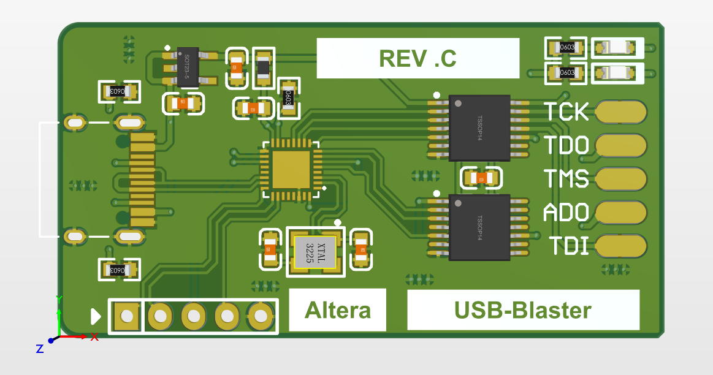
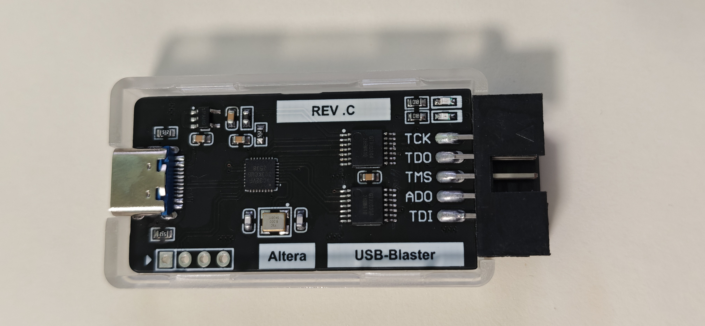
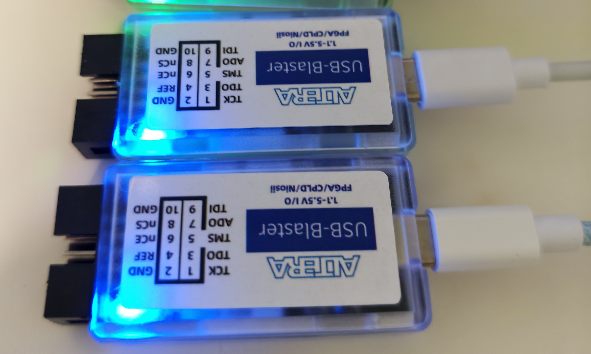

## An Altera USB Blaster Based on AGM32

### Developed using MCU+CPLD architecture, supports JTAG/PS/AS. The design follows the official approach while achieving a higher JTCK frequency of 20 MHz.

### Main controller: AGRV2KQ32；Level shifter: GTXU0304.

### Useage
1. The Hardware folder includes schematics, and the Blaster.PcbDoc file can be directly used for PCB fabrication.
2. For firmware burning, please refer to the official AGM32 tutorial in the Firmware folder.
3. Now you can program Intel/Altera JTAG/AS/PS devices with Quartus or use it as a generic JTAG-adapter (where USB-Blaster is supported) .

### Actual Implementation

Figure 1: PCB 3D View
 

***

Figure 2: PCB Layout
 

***

Figure 3: Finished Board
 

***

